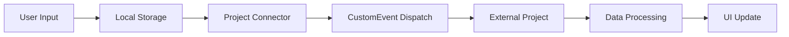

# 🔄 Project Connector Implementation Summary

## 🎯 What Was Implemented

I've successfully implemented a real-time data sharing system between your farm management app and another project without requiring backend or API URLs. Here's what was added:

### 📁 New Files Created

1. **`src/services/projectConnector.ts`** - Core connector service
2. **`src/components/ProjectConnector.tsx`** - UI component for monitoring
3. **`src/components/TestStockForm.tsx`** - Test form for sending data
4. **`src/components/TestReceiver.tsx`** - Test component for receiving data
5. **`PROJECT_CONNECTOR_INSTRUCTIONS.md`** - Detailed instructions for external project
6. **`CONNECTOR_IMPLEMENTATION_SUMMARY.md`** - This summary document

### 🛠️ Modified Files

1. **`src/components/AppLayout.tsx`** - Added ProjectConnector component
2. **`src/pages/InventoriPage.tsx`** - Added test forms for demonstration

## 🚀 How It Works

### Real-time Data Flow

1. **User submits data** in your farm app (stock items, production data, etc.)
2. **Data is saved locally** using localStorage persistence
3. **Data is automatically shared** to external project via CustomEvents
4. **External project receives** the data in real-time
5. **Both projects stay synchronized** without backend infrastructure

### Technical Implementation

- **localStorage**: Persistent data storage across browser sessions
- **CustomEvents**: Real-time communication between browser tabs/windows
- **Event-driven architecture**: Decoupled, scalable data flow
- **Project identification**: Ensures data goes to correct target project

## 📊 Data Types Being Shared

### 1. Stock Items
- Product name, quantity, unit, category
- Minimum stock levels
- Creation/update timestamps
- Source form information

### 2. Production Data
- Egg count, feed consumption, mortality
- Kandang information
- Action types and labels
- Notes and metadata

### 3. Kandang Data
- Kandang names and locations
- Capacity and current stock
- Metadata information

## 🎨 User Experience Features

### Visual Feedback
- **Sharing indicators** during data transmission
- **Success messages** when data is shared
- **Status dashboard** showing connection health
- **Real-time counters** for pending/sent/received data

### Automatic Features
- **Auto-sync** on component mount
- **Data persistence** across sessions
- **Error handling** and retry mechanisms
- **Storage cleanup** for processed data

## 📋 Instructions for External Project

### Quick Setup (3 Steps)

1. **Copy files**:
   ```
   src/services/projectConnector.ts
   src/components/ProjectConnector.tsx
   ```

2. **Initialize connector** in your external project:
   ```typescript
   import { useEffect } from "react";
   import { getProjectConnector, CONNECTOR_EVENTS } from "@/services/projectConnector";

   function App() {
     useEffect(() => {
       const connector = getProjectConnector("your-project-id", "farm-management-app");
       
       const handleDataReceived = (event: any) => {
         const data = event.detail;
         // Process incoming data based on type
         console.log("Received:", data);
       };
       
       window.addEventListener(CONNECTOR_EVENTS.DATA_RECEIVED, handleDataReceived);
       
       return () => {
         window.removeEventListener(CONNECTOR_EVENTS.DATA_RECEIVED, handleDataReceived);
       };
     }, []);
     
     return (/* your JSX */);
   }
   ```

3. **Handle data types**:
   ```typescript
   // Handle different data types
   switch(data.type) {
     case "stock_item":
       // Process stock data
       break;
     case "production_data":
       // Process production data
       break;
     case "kandang_data":
       // Process kandang data
       break;
   }
   ```

### Detailed Instructions

See `PROJECT_CONNECTOR_INSTRUCTIONS.md` for:
- Complete setup guide
- Data structure documentation
- Advanced configuration options
- Troubleshooting tips
- Best practices
- Example implementations

## 🔧 Configuration Options

### ProjectConnector Component Props
```typescript
<ProjectConnector 
  projectId="your-project-id"           // Your project identifier
  targetProjectId="farm-management-app" // Target project to connect to
  autoSync={true}                       // Auto-sync on mount
  showStatus={true}                     // Show status panel
/>
```

### Custom Data Types
You can extend the system to handle any data type:
```typescript
// Add to SharedDataType in projectConnector.ts
export type SharedDataType = 
  | "stock_item"
  | "production_data" 
  | "kandang_data"
  | "your_custom_type";  // Add your type

// Handle in external project
if (data.type === "your_custom_type") {
  processYourCustomData(data.data);
}
```

## 📈 Monitoring & Debugging

### Connector Status
The dashboard shows:
- Pending records count
- Sent records count  
- Received records count
- Processed records count
- Connected projects count

### Console Logging
Enable debug mode in `projectConnector.ts`:
```typescript
const DEBUG_MODE = true; // Enable detailed logging
```

### Data Inspection
```typescript
const connector = getProjectConnector("your-project-id");

// View all stored data
console.log(connector.getStoredData());

// View by type
console.log(connector.getDataByType("stock_item"));

// View pending data
console.log(connector.getPendingData());

// Get status
console.log(connector.getStatus());
```

## 🛡️ Security & Limitations

### Browser Storage Limits
- localStorage: ~5MB per domain
- sessionStorage: ~5MB per domain
- IndexedDB: ~50MB (with user permission)

### Security Considerations
- Data stored in browser (not suitable for sensitive information)
- No encryption by default
- Same-origin policy restrictions
- Data persistence tied to browser storage

### Best Practices
- Regularly clean processed data
- Validate all incoming data
- Handle storage quota exceeded errors
- Implement data backup strategies

## 🎯 Testing the Implementation

### In Your Current App

1. Open the preview (click the button in the tool panel)
2. Navigate to Inventory section
3. Add a new stock item using the test form
4. Notice the "Sharing..." indicator
5. Check the receiver panel for incoming data
6. Check the connector status panel for counters

### Testing with External Project

1. Create a new React project
2. Copy the connector files
3. Initialize the connector with matching project IDs
4. Open both apps in different browser tabs
5. Add data in one app, see it appear in the other

## 🔄 Data Flow Example



## 📞 Support

If you encounter issues:
1. Check browser console for errors
2. Verify project IDs match between projects
3. Ensure both projects are running in same browser
4. Clear localStorage if needed: `localStorage.clear()`
5. Refer to `PROJECT_CONNECTOR_INSTRUCTIONS.md` for detailed troubleshooting

## 🚀 Next Steps

1. **Test the implementation** using the preview
2. **Set up the external project** using provided instructions
3. **Customize data types** for your specific needs
4. **Add monitoring** to track data flow
5. **Implement error handling** for production use

The system is now ready for real-time data sharing between your projects!